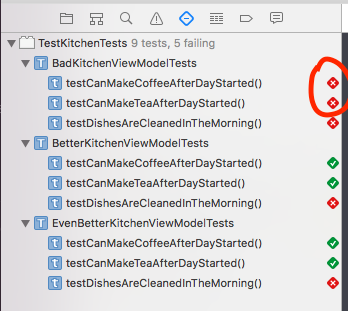

## What
This is reference implementation of unit testing functionality of the methods (we call them actions) of the Class that produce an accumulated state.
## Why 
To highlight an importance of keeping test isolated - independent of actions that are not part of the testing scenario  
## How
`KitchenViewController` is a buiseness logic Class. It has five methods:
```Swift
//Initialization function
startTheDay() 
//action functions
doDishes()
makeCoffee()
makeTea()
//wrap up function
finishTheDay() 
```
In our test case we would like to test three functionalities:
- Dished are being cleaned in the morning
- Kitchen can make coffee
- Kitchen can make tee

There are three implementations of the TestCase classes testing this functionality:
1. `BadKitchenViewModelTests` - "Naive" implementation that compares state before and after actions applied
2. `BetterKitchenViewModelTests` - Implementation that isolates parts of the state that can be impacted, by filtering out non relevant parts of the state
3. `EvenBetterKitchenViewModelTests` - improvement on implementation #2 - by using custom `assertExpectedValues` function we don't need to explicitly filter relevant state parts in every case function

To demonstrate the test functionality we first run all the tests and see that they all pass. Then we 'decide to do dishes in the evening' by commenting out `doDishes()` call in in the `startTheDay()` function in [KitchenViewModel](Source/TestKitchen/KitchenViewModel.swift#L18) and un-commenting `doDishes()` call in `finishTheDay()`. After that we run tests again. Expectation is that our `testDishesAreCleanedInTheMorning()` will fail but all other tests `testCanMakeCoffee()` and `testCanMakeTea()` fill pass. But in our `BadKitchenViewModelTests` tests that nothing to do with 'washing dishes' are failing as well!! 



This  means that someone who's concern is about 'doing dishes in the evening' will suddenly have to learn how 'to do coffee and tee' to make this tests to pass! 


 
